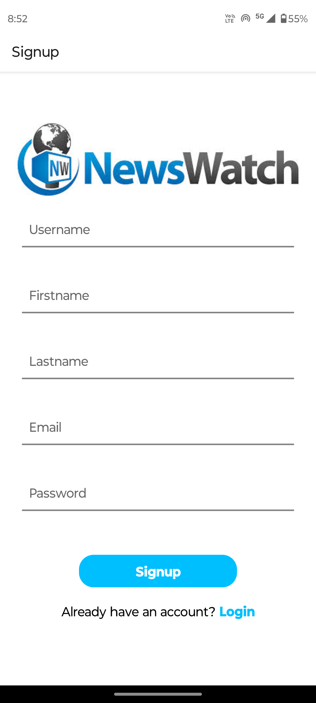
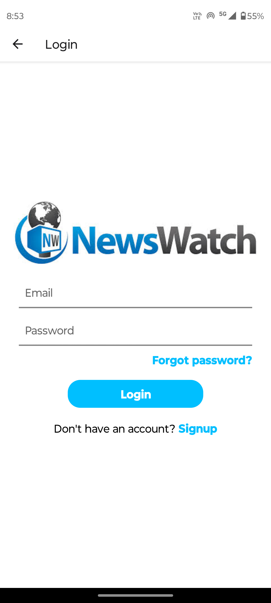
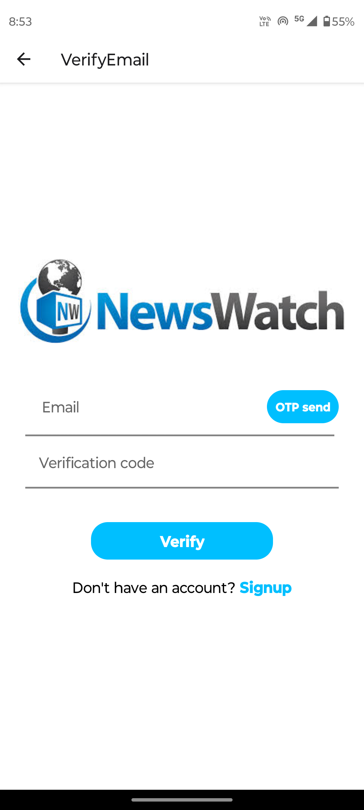
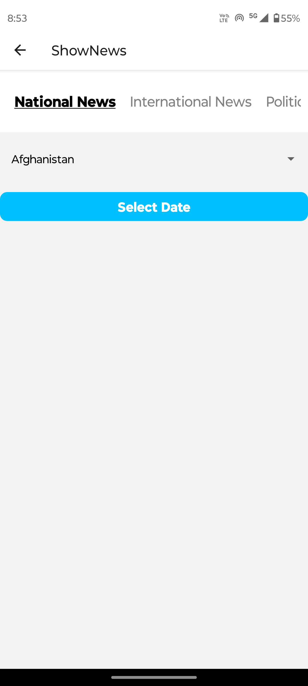
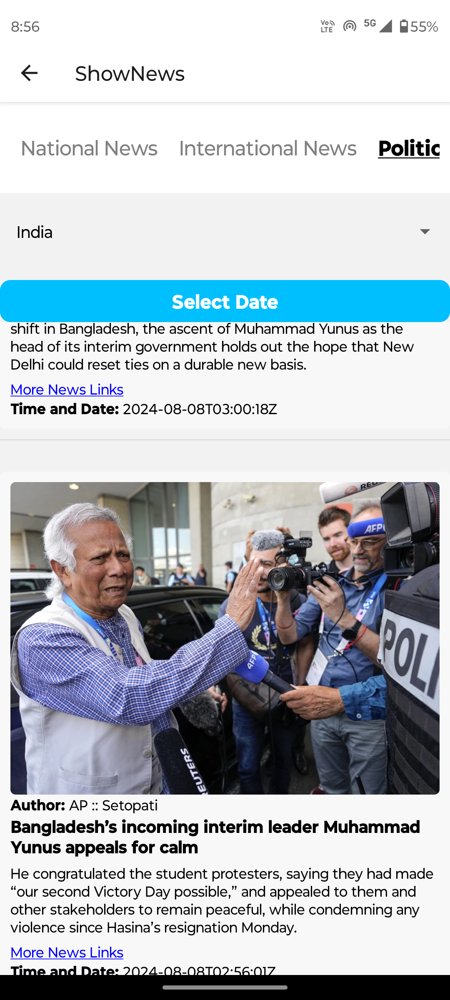

# Project Setup Instructions

# Backend Setup

### 1. Prisma Setup
- **Install Prisma CLI:**  
  `npm install @prisma/cli --save-dev`

- **Initialize Prisma:**  
  `npx prisma init`

- **Install Prisma Client:**  
  `npm install @prisma/client`

- **Generate Prisma Client:**  
  Before starting to code, run the following command to generate the Prisma Client:  
  `npx prisma generate`

### 2. MongoDB Setup
- **Install Mongoose:**  
  `npm install mongoose`

### 3. Express.js Setup
- **Install Express.js:**  
  `npm install express`

### 4. Starting the Backend
- **Install All Dependencies:**  
  `npm install`

- **Start the Backend Server:**  
  `npm start`

### 5. Authentication Setup
- **Install JSON Web Token (JWT):**  
  `npm install jsonwebtoken`

- **Token Storage with Cookies:**  
  Install the `cookie-parser` package to manage cookies:  
  `npm install cookie-parser`

- **Set Token Expiration:**  
  The login token will expire after 2 days.

### 6. Forgot Password Implementation
- **Use Nodemailer for Sending Emails:**  
  Implement the backend to use Nodemailer for sending a verification email when the user forgets their password. The user should be able to verify their email and set a new password.

- **Redirect After Password Reset:**  
  After setting the new password, the user should be redirected back to the sign-in page to log in with the new password.

---

## Frontend Setup


# Project Setup Instructions

## Backend Setup

### 1. Prisma Setup
- **Install Prisma CLI:**  
  `npm install @prisma/cli --save-dev`

- **Initialize Prisma:**  
  `npx prisma init`

- **Install Prisma Client:**  
  `npm install @prisma/client`

- **Generate Prisma Client:**  
  Before starting to code, run the following command to generate the Prisma Client:  
  `npx prisma generate`

### 2. MongoDB Setup
- **Install Mongoose:**  
  `npm install mongoose`

### 3. Express.js Setup
- **Install Express.js:**  
  `npm install express`

### 4. Starting the Backend
- **Install All Dependencies:**  
  `npm install`

- **Start the Backend Server:**  
  `npm start`

### 5. Authentication Setup
- **Install JSON Web Token (JWT):**  
  `npm install jsonwebtoken`

- **Token Storage with Cookies:**  
  Install the `cookie-parser` package to manage cookies:  
  `npm install cookie-parser`

- **Set Token Expiration:**  
  The login token will expire after 2 days.

### 6. Forgot Password Implementation
- **Use Nodemailer for Sending Emails:**  
  Implement the backend to use Nodemailer for sending a verification email when the user forgets their password. The user should be able to verify their email and set a new password.

- **Redirect After Password Reset:**  
  After setting the new password, the user should be redirected back to the sign-in page to log in with the new password.

---

##

## Frontend Setup

### Project Name: News App

- **Framework:** React Native
- **Language:** TypeScript
### 1. Install React Native CLI
```bash
 npm install -g react-native-cli
 npx react-native init NewsApp --template react-native-template-typescript
 // React Navigation
 npm install @react-navigation/native @react-navigation/stack
npm install react-native-gesture-handler react-native-reanimated react-native-screens react-native-safe-area-context @react-native-community/masked-view

// Axios for API Requests
npm install @expo/vector-icons
```
- **API Key:** Used for fetching news data
- **Routing:** React Native navigation for routing
- **Components:**
  - **Login Page**
  - **Signup Page**
  - **Show News Page**
    - News is displayed based on the selected date and country.
    - News is categorized into all available categories.
  
- **News Display:**
  - Users can set the date and select a country to filter the news.
  - The app will show all categories of news based on the user's preferences.






